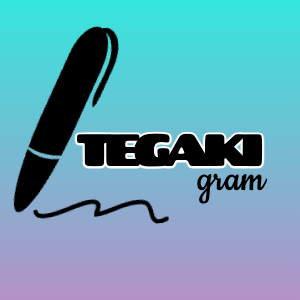

# TEGAKIgram

## サイト概要
### サイトテーマ
手書きPOP、看板に特化したSNSサイト
​
### テーマを選んだ理由
手書きPOPやメニューは、店舗の個性や温かみを伝える重要なツールとして、飲食業や小売業で根強い人気を誇ります。
しかし値段、量、産地など記入した情報のほとんどがその日限り情報のため、一度使用されると廃棄され、記録として残りにくいという課題があります。

私自身、前職で毎日のように手書きPOPやメニューを作成していましたが、せっかく工夫したデザインもその日限りで消えてしまうことに課題を感じていました。また、フォントやレイアウトのマンネリ化を防ぐために、他店を訪れたりネットで検索する手間が発生しており、手書きPOPのアイデアを気軽に共有・蓄積できる場が必要だと考えました。

手書きPOPの魅力を発信し、記録・参考・交流の場として、新しいレイアウトやデザインのインスピレーションを得られるサービスがあればと思い、製作しました。

### ターゲットユーザー
* 手書きPOPが好きで色々な作品をまとめてみたい人
* 手書きPOPのアイデアを探している人
* 作成した自分の手書きPOPを記録したい人
* 普段からInstagramを利用していて「＃手書きPOP」で探している人

### 主な利用シーン
* 作成した手書きPOPを投稿する時
* 他人の投稿を見て楽しみたいとき
* 過去に作成した手書きPOPを見返したい時

## 設計書

作成中

## オリジナルロゴ

​
## 開発環境
- OS：Linux(CentOS)
- 言語：HTML,CSS,JavaScript,Ruby,SQL
- フレームワーク：Ruby on Rails
- JSライブラリ：jQuery
- IDE：vscode

## バージョン
- Rails version: 6.1.7.10
- Ruby version: ruby 3.1.2p
​
## 使用素材

<!-- - 外部サービスの画像素材・音声素材を使用した場合は、必ずサービス名とURLを明記してください。 -->
イラスト・写真
- https://pixabay.com/ja/
- https://www.ac-illust.com/

アイコン
- https://fontawesome.com/account/general
ロゴ制作
- https://www.designevo.com/jp/create/

<!-- - アプリケーションの実装に使用したgem/bootstrapのリファレンスなどの記載は不要です。 -->
<!-- - 使用しない場合は、使用素材の項目をREADMEから削除してください。 -->
<!-- - 架空の団体・題材を前提にポートフォリオを制作する場合、下記のテンプレートを当項目内に記載しましょう。 -->
著作権を考慮し、架空のデータを扱う予定です。
なお今後、実在するデータを利用する際には、事前に著作権保持者と契約を結んだ上で利用します。